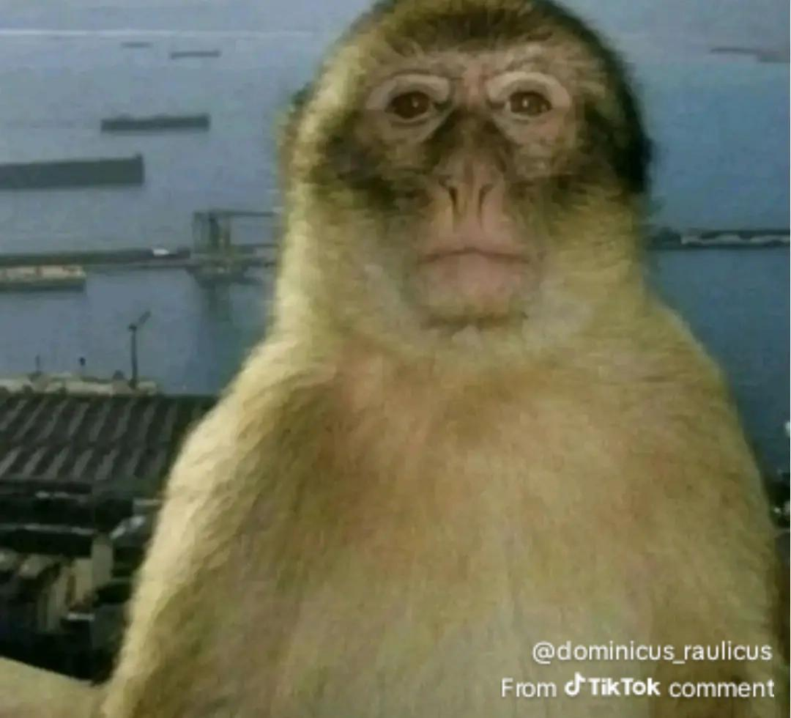
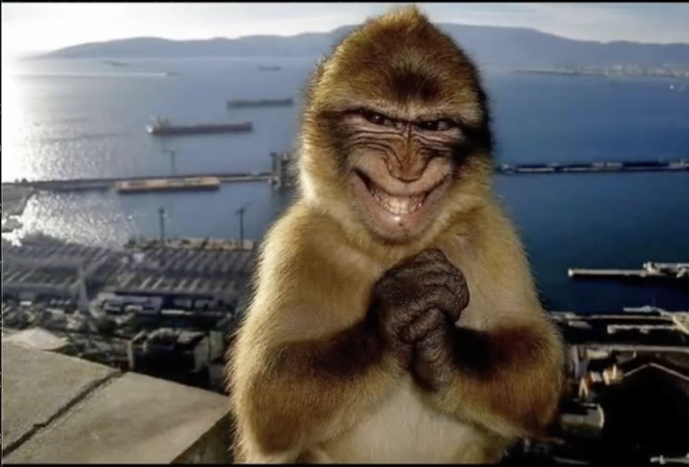
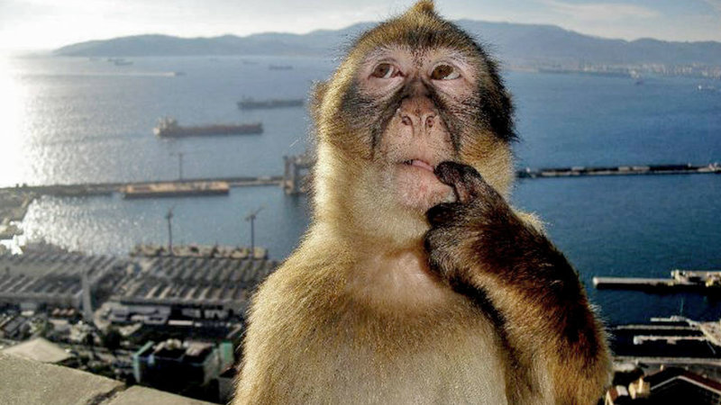

# Monkey Gesture Detector

A webcam-based gesture toy that switches reaction images in real time.

## What It Does

- Uses your camera feed and runs face + hand tracking with MediaPipe.
- Shows your webcam on the left and the current reaction image on the right.
- Detects simple hand/face gestures and swaps the image automatically.
- Includes a `TRACKING: ON/OFF` button to hide/show hand overlay visuals.

## Core Gesture Behavior

- No hands for a short moment -> `blank.jpg`
- One or two neutral hands -> `smile.jpg`
- Two hands together -> `evil.png`
- Finger near upper lip -> `think.jpg`
- Fist -> `fist.png`
- Mouth open wide (no hands) -> `mouth.png`
- Tongue out -> `tongue.png`

The app smooths detections across recent frames to reduce flicker.

## Quick Start

1. Open this folder.
2. Serve it with any local static server (or open `index.html` directly).
3. Allow camera access when prompted.
4. Make faces and hand signs.

## Basic Image References

### Blank

### Evil

### Smile

### Think

